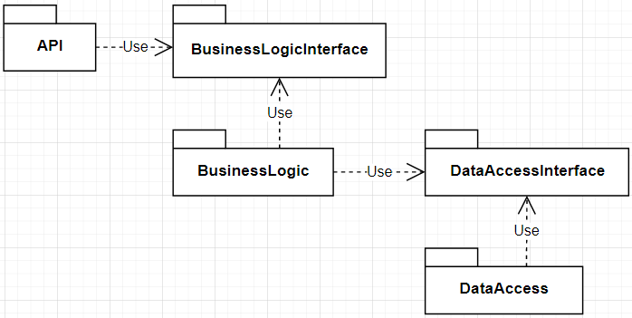

# Inyección de dependencias

La tecnología que vamos a estar usando, la cual es **[ASP.NET](http://asp.NET) Core** soporta el patron de diseño inyección de dependencia. La cual es una **técnica** para lograr la i**nversion de control** o el **principio de inversion de dependencia** entre clases y sus dependencias. 

# Qué es una dependencia?

Una dependencia es un ***objeto*** que otro **objeto** necesita, depende de el. Cuando hablamos de objeto nos podemos referir a componentes, librerías, módulos, clases, funciones, entre otras. 

El **concepto** de dependencia esta arraigado a cuando **usas.** En la notación UML es una relación de uso, por ejemplo cliente-servidor.

A nivel de clase se da cuando una clase **A** utiliza otra clase **B,** sin que esta forme parte del estado de **A**. Esto lo podemos ver cuando la clase **A** necesita realizar una lógica que es propia de la clase **B** entonces se da el uso de **B** en **A.**

Se puede dar cuando:

- **A** recibe por parámetro un objeto de tipo **B.**
- Un método de **A** devuelve un objeto de tipo **B.**
- Un método de **A** menciona un objeto de tipo **B.**

Cuando de decimos ***objeto de tipo B*** nos estamos refiriendo a una ***instancia de tipo B.***


## **Ventajas de ID**

Logramos resolver lo que antes habíamos descrito como desventajas o problemas.

1. Código más limpio. El código es más fácil de leer y de usar.
2. Nuestro software termina siendo más fácil de Testear.
3. Es más fácil de modificar. Nuestros módulos son flexibles a usar otras implementaciones. Desacoplamos nuestras capas.
4. Permite NO Violar SRP. Permite que sea más fácil romper la funcionalidad coherente en cada interfaz. Ahora nuestra lógica de creación de objetos no va a estar relacionada a la lógica de cada módulo. Cada módulo solo usa sus dependencias, no se encarga de inicializarlas ni conocer cada una de forma particular.
5. Permite NO Violar OCP. Por todo lo anterior, nuestro código es abierto a la extensión y cerrado a la modificación. El acoplamiento entre módulos o clases es siempre a nivel de interfaz.

## Ciclos de vida de los servicios

Los servicios pueden registrarse con los siguientes ciclos de vida:

1. Transient
2. Scoped
3. Singleton

### Transient

Estos servicios son creados cada vez que son solicitados desde el contenedor de servicios. Este ciclo de vida sirve mejor para servidores stateless livianos. Para registrar servicios transient se tiene que utilizar **`AddTransient`**.

### Scoped

Estos servicios son creados por cada request cliente. Para registar estos servicios se hace con **`AddSingleton`**.

### Singleton

Estos servicios son creados la primera vez que son pedidos o por el desarrollador, cuando se provee una instancia de la implementacion directamente en el contenedor.

Esto quiere decir que todas las requests utilizan la misma instancia.


1. Nuestra API.
2. BusinessLogic, nuestra lógica de negocio.
3. DataAccess/Repository, capa de acceso a nuestro datos.

Teniendo esto en mente podríamos diseñar nuestra aplicación de la siguiente manera:

### Diagrama de paquetes



Este diagrama es un diagrama estático, nos muestra que paquete usa a quien, no nos dice como pero sabemos que es por medio de una dependencia. Analicemos las dependencias:

1. **API → BusinessLogicInterface:** esta dependencia es de interfaz lo cual nos asegura que el acoplamiento es el correcto porque no es de implementacion.
2. **BusinessLogic → BusinessLogicInterface:** esta dependencia es porque **BusinessLogic** es el paquete encargado de implementar las interfaces que se encuentran en **BusinessLogicInterface**, se esta dependiendo de algo mas abstracto lo cual indica que el acoplamiento es el correcto.
3. **BusinessLogic → DataAccessInterface:** esta dependencia va de un paquete concreto a uno abstracto el cual es el correcto porque es una dependencia de interfaz y no de implementacion.
4. **DataAccess → DataAccessInterface:** esta dependencia es porque **DataAccess** es el paquete encargado de implementar las interfaces que se encuentran en **DataAccessInterface**, se esta dependiendo de algo mas abstracto lo cual indica que el acoplamiento es el correcto.

### Vista de componentes y conectores


Este diagrama es un diagrama dinámico, nos muestra como los diferentes proyectos que viven en la RAM, en tiempo de procesador, se comunican entre ellos por medio de interfaces.

Para nuestro ejemplo, tomemos una clase de cada paquete de manera de ilustrar como funcionaria la inyección de dependencias a través de nuestro flujo.

- API - MovieController
- BusinessLogicInterface - IMovieLogic
- BussinesLogic - MovieBussinessLogic
- DataAccessInterface - IMovieRepository
- DataAccess - MovieRepository

## Empecemos a programar

1. Crearemos dos proyectos de clase a la solucion, uno que se va a llamar **BusinessLogicInterface** y el otro **BusinessLogic**. Primero vamos hacer la inyeccion de dependencia para la logica de negocio y luego lo haremos igual con **DataAccess.**
    1. Para crear un **proyecto de clase** en **VSC** se tiene que usar los siguientes comando:

        > *dotnet new classlib -n BusinessLogicInterface
        dotnet sln add BusinessLogicInterface
        dotnet new classlib -n BusinessLogic
        dotnet sln add BusinessLogic
        dotnet add BusinessLogic reference BusinessLogicInterface
        dotnet add WebApi reference BusinessLogicInterface*

        Lo que se hace en los comandos es crear los proyectos luego agregarlos a la solución, una vez agregados a la solución se empieza a agregar las referencias entre ellos como se había mostrado en el diagrama de paquetes.

      2.  Para crear un **proyecto de clase** en **VS** se tienen que seguir los siguientes pasos:

    1. Click derecho en la solución → Add → New Project

    

    2. Hacer doble click en **Class Library (.NET Standard)** que se encuentra a la izquierda o seleccionar **All project types** en el combo de arriba a la derecha y luego seleccionar la opción **Class Library (.NET Standard)**

    

    3. Escribir el nombre **BusinessLogicInterface** y darle **Create.**

    

    4. Ahora para agregar la referencia de **BusinessLogicInterface** en **WebApi** hacemos click derecho en **Dependencies** de **WebApi** y seleccionamos **AddReference.**

    

    5. En la parte de **Projects** seleccionamos el proyecto que recién creamos (**BusinessLogicInterface)** y le damos a **Ok**

    

    6. Para crear el proyecto **BusinessLogic** hay que repetir los pasos desde el **1** hasta el **5**

💡 La creación de los proyectos se puede hacer por comando por mas que se este usando **VS,** ya que estos se agregan a la solución entonces se podrán ver.

Luego de que ya tienen los dos proyectos creados y referenciados correctamente pasaremos a crear una interfaz llamada **IMovieLogic** en el proyecto **BusinessLogicInterface** y una clase **MovieLogic** en el proyecto **BusinessLogic** la cual implementara la interfaz **IMovieLogic.**

El explorador de la solución quedaría algo así:


---

## Inyección de BusinessLogic

Siguiendo el diagrama vemos que la **WebApi** solo conoce **BusinessLogicInterface** y tomando en cuenta la introducción, la inyección de **IMovieLogic** en **MovieController** seria así:

## WebApi

```csharp
namespace WebApi.Controller
{
	[Route("api/movies")]
	public class MovieController : VidlyControllerBase
	{
		private readonly IMovieLogic moviesLogic;
	
		public MovieController(IMovieLogic moviesLogic)
		{
			this.moviesLogic = moviesLogic;
		}
	
		//...API CODE
	}
}
```

### BusinessLogicInterface

```csharp
namespace BusinessLogicInterface
{
	public interface IMovieLogic
	{
		//...MOVIE OPERATIONS
	}
}
```

### BusinessLogic

```csharp
namespace BusinessLogic
{
	public class MovieLogic : IMovieLogic
	{
		// ...BUSINESS LOGIC CODE
	}
}
```

Por ahora lo que hicimos fue definir una interfaz, una clase concreta que la implementa y una clase que le pasan una interfaz y esta la utiliza.

A esta altura se deberían de estar preguntando:

> **Quién es el encargado de crear estas clases?**

Porque alguien tiene que hacerlo en algún momento. Vayamos a ver la clase **WebApi.Startup.**

## Startup

Esta clase es la encargada de registrar los servicios, que son dependencias, en un contenedor, y dependiendo del ciclo de vida que se les marque a estos servicios, va a ser el momento en el cual se cree una instancia.

Siguiendo con Vidly, se vería de la siguiente manera:

```csharp
namespace WebApi
{
	public class Startup
	{
		//...STARTUP CODE
		
		public void ConfigureServices(IServiceCollection services)
		{
			//...CONFIGURE_SERVICES CODE
			
			//Registrando el servicio IMovieLogic
			services.AddScoped<IMovieLogic, MovieLogic>();
		}

		//...MORE STARTUP CODE
}
```

Si quieren profundizar mas sobre como funciona internamente `AddScoped` y porque lo usamos para nuestra WebAPI toquen el librito  → [📗](https://docs.microsoft.com/en-us/aspnet/core/fundamentals/dependency-injection?view=aspnetcore-3.1#scoped)

# Referencias extra

- [Dependency injection in ASP.NET Core](https://docs.microsoft.com/en-us/aspnet/core/fundamentals/dependency-injection?view=aspnetcore-3.1#entity-framework-contexts)
- [App startup in ASP.NET Core](https://docs.microsoft.com/en-us/aspnet/core/fundamentals/startup?view=aspnetcore-3.1)